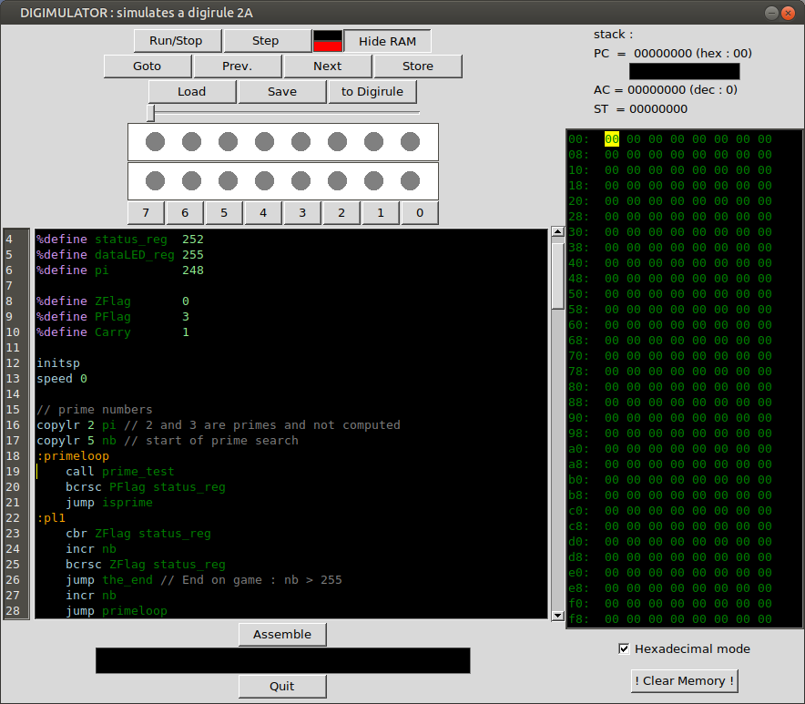

# digimulator
Simulator of **digirule 2** (https://bradsprojects.com/digirule2/) written in Python (by roro &amp; wawa &amp; toto)



# Installation

You must have Python 3.6 or above with tkInter - usually installed with your python distribution.
On Ubuntu, if you don't have tkintern install it via
```
sudo apt install python3-tk
```

besides that, you will need ton install *serial* and *serial-tool* with
```
sudo pip3 install serial serial-tool
```

# Instruction set

Digimulator offers several instruction sets :
- the legacy *Digirule 2A* 
- the *Digirule 2B* enhanced instruction set. See https://github.com/wawachief/DGR2B for more informations.
- the new *digirule 2U* with USB communication

# Assembler Quick guide

## Assembler special commands

- **%define** : defines constants. Usage : `%define NAME VALUE`
```
// Constants
%define statusRegister  252
%define dataLEDRegister 255
%define hideAddressBit  2
```
- **%data** : inserts one or many bytes in the code. Usage : `%data NAME byte1 byte2 ... byten`
```
// Variables declarations
%data index 0
%data lineadr 0

// Drawing
%data POV 126 129 165 129 165 153 129 126
```

## Labels
Labels begin with `:`.
```
:loop
	copyir lineadr dataLEDRegister
	incr lineadr
	decrjz index
	jump loop
```
## Comments

Comments begin with `//`

## Numbers 

Numbers are 8 bits long and can be in decimal (`127` for example), hexadecimal (beginning with '0x') or in binary , beginning with `0b` (`0b11110101` for example).


# Licence
GNU General Public License v3.0
